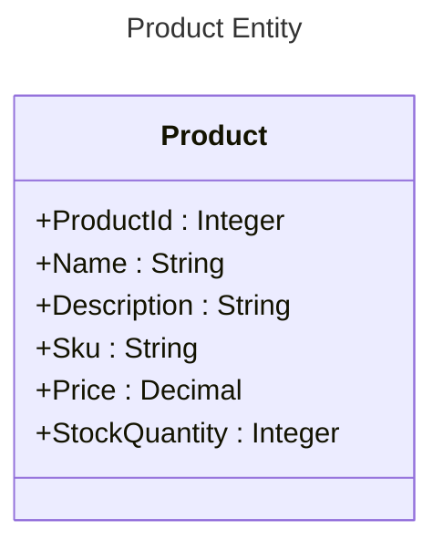
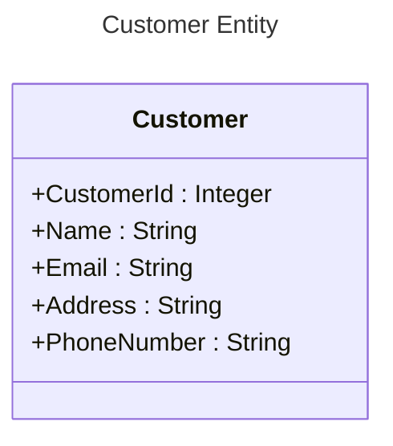

# Play.VB.NET - FakeShop application

## Playing with VB.NET

* .NET Framework 4.8.1
* Visual Studio 2022
* C#
* XML

* Class Library (.NET Framework)
* WPF App (.NET Framework)
* ASP.NET Web Application (.NET Framework)

